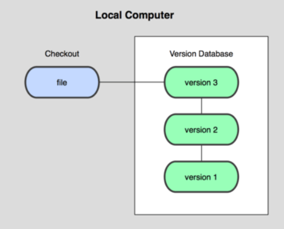
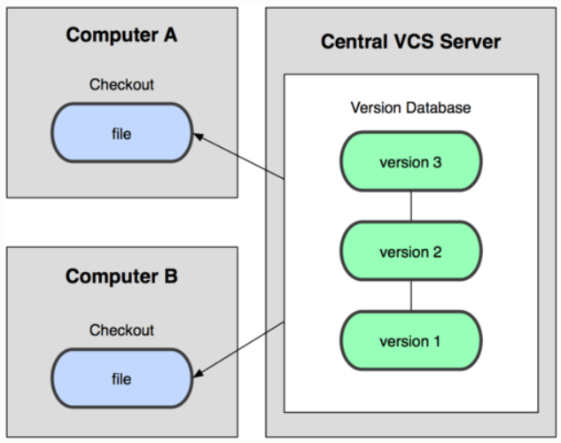
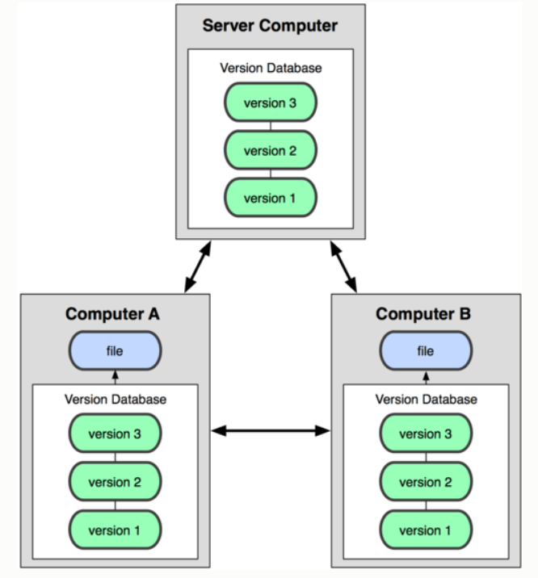
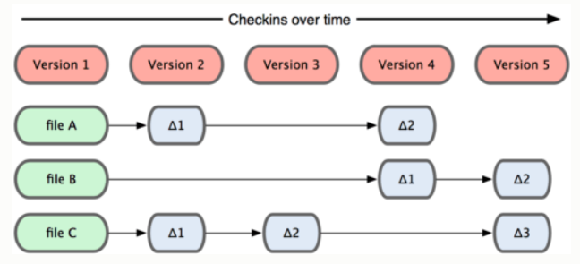
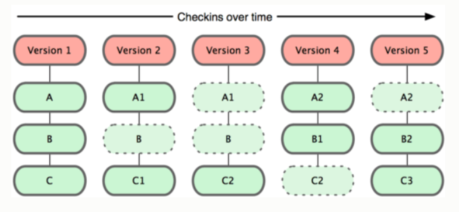
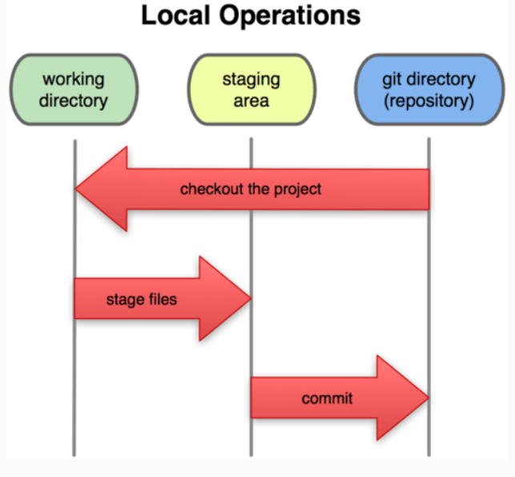
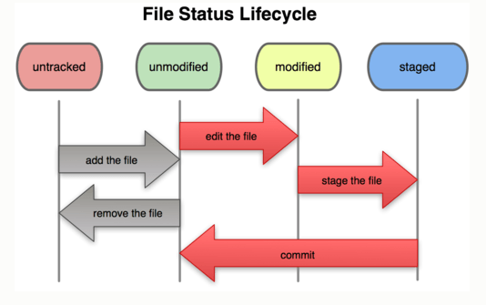

# GIT

Tài liệu: https://git-scm.com/book/en/v2

## Chapter 1: Get started

### 1. Version Control System (VCS)

#### 1.1. Version Control System

Hệ thống quản lý phiên bản
- VCS là một hệ thống giúp lưu trữ các thay đổi của tập hợp các tập tin theo thời gian.
- VCS giúp:
  - Khôi phục lại phiên bản cũ của các file
  - Khôi phục lại phiên bản cũ của toàn bộ dự án
  - Xem lại các thay đổi đã được thực hiện theo thời gian
  - Xem người thực hiện thay đổi...

#### 1.2. Local Version Control Systems (LVCSs)

Hệ thống quản lý phiên bản cục bộ
- Thực hiện copy các file sang một thư mục khác -> đơn giản nhưng dẽ gây lỗi, khó quản lý
  -> Khắc phục: dùng một database đơn giản lưu trữ tất cả sử thay đổi của các files qua các phiên bản.

  

- Hệ thống quản lý phiên bản RSC (được sử dụng trên HĐH Mac OS X): lưu giữ các bản vá ~ sự thay đổi của các files ở các phiên bản -> có thể khôi phục các files bằng các gộp các bản vá với nhau.

#### 1.3. Centralized Version Control Systems (CVCSs)

Hệ thống quản lý phiên bản tập trung

- LVCSs không giải quyết được vấn đề làm việc nhóm trong một hệ thống

  -> Cần CVCSs

- Gồm:

  - Máy chủ chứa tất cả các tập tin được versioned
  - Danh sách máy khách có quyền thay đổi các tập tin đó

  

- Ưu điểm:
  - Có thể biết được công việc người khác làm trong dự án
  - Quản lý có thể quản lý người dùng, files theo ý muốn
  - Làm việc nhóm dễ dàng hơn so với LVCSs
- Nhược điểm:
  
  - Tập trung -> Máy chủ hỏng -> Mất toàn bộ dữ liệu, chỉ còn các phiên bản trên máy cục bộ

#### 1.4. Distributed Version Control Systems (DVCSs)

Hệ thống quản lý phiên bản phân tán

- Gồm:

  - Máy chủ chứa các tập tin được versioned
  - Máy khách sao chép toàn bộ repository

  -> Khắc phục vấn đề của CVCSs: khi máy chủ ngừng hoạt động, máy khách có thể sao chép ngược về máy chủ đề khôi phục toàn bộ hệ thống

  

### 1.2.  A short history of Git

Sơ lược lịch sử của Git

- Trong thời gian bảo trì của nhân Linux (1991-2002), các thay đổi của phần mềm được truyền đi dưới dạng các bản vá  và tập tin lưu trữ
- Năm 2002, dự án nhân Linux bắt đầu sử dụng DVCS độc quyền là BitKeeper
- Năm 2006, sự hợp tác giữa cộng đồng phát triển nhân Linux và công ty thương mại phát triển BitKeeper bị phá vỡ, và công cụ đó không được cung cấp miễn phí nữa.
- Điều này thúc đấy cộng đồng phát triển Linux (Linus Torvalds - người sáng lập ra Linux) phát triển công cụ của riêng họ dựa trên việc sử dung BitKeeper
- Mục tiêu chính của hệ thống:
  - Nhanh
  - Thiết kế đơn giản
  - Hỗ trợ tốt cho phát triển phi tuyển tính (non-linear development)
  - Phân tán toàn diện
  - Có khả năng xử lý các dự án lớn hiệu quả

### 1.3. What is Git ?

#### 1.3.1. GIt vs. other VCS

Git với các VCS khác

- Các VCS khác:

  - Lưu trữ thông tin dưới dạng danh sách các tập tin được thay đổi: coi thông tin được lưu trữ như là một tập tin và các thay đổi được thực hiện trên mỗi tập tin theo thời gian

    

- Git:

  - Coi dữ liệu như một tập các snapshot của hệ thống tập tin nhỏ, Mỗi lần commit thì Git chụp một bức ảnh ghi lại nội dung của tất cả cá tập tin tại một thời điểm đó và tạo một tham chiếu tới snapshot đó.

  - Tập tin không có thay đổi sẽ không lưu trữ lại mà chỉ tạo một liên kết tới tập tin gốc đã tồn tại trước đó.

    

#### 1.3.2. The three States

Ba trạng thái

- Mỗi tập tin được quản lý dữ trên 3 trạng thái:
  - Commited: dữ liệu được lưu trữ an toàn trong database
  - Modified: đã thay đổi tập tin nhưng chưa commit và database
  - Staged: đã đánh dấu sẽ commit phiên bản hiện tại của một tập tin đã chỉnh sửa trong lần commit sắp tới

- Ba phần của một dự án sử dụng Git:

  - Git directory: chưa metadata và database cho dự án, được sao lưu về khi clone một repository từ máy tính khác
  - Working directory: là bản sao một phiên bản của dự án. Tập tin này được pulled từ database, nén lại trong Git directory và lưu trên ổ cứng để sử dụng và chỉnh sửa.
  - Staging area: là một tập tin được chứa trong Git directory, chứa thông tin về  những  gì được commit  trong lần commit sắp tới

- Workflow cơ bản của Git:

  1. Thay đổi các file trong Working directory
  2. Tổ chức các tập tin, tạo mới snapshot bằng cách stage các thay đổi vào Staging area
  3. Commit, lưu các tập tin trong Staging area vào Git directory

  

  

### 1.4. The Command Line

### 1.5. Installing Git

### 1.6. First time Git setup

- Tên tài khoản và email:

  ```
  git config --global user.name "name"
  ```

  ```
  git config --global user.email email@example.com
  ```

- Trình soạn thảo:

  ```
  git config --global core.editor vim
  ```

- Công cụ so sánh thay đổi:

  ```
  git config --global merge.tool vimdiff
  ```
  
  
  
## Chapter 2: Git Basics

### 2.1. Getting a Git Repository

Tạo một kho chứa Git
Có hai cách chính:

- Tạo một kho  chứa từ thư mục cũ:

  ```
  git init
  ```
  
- Sao chép một kho chứa đã tồn tại:

  ```
  git clone [url] [folder_name]
  ```
### 2.2. Recording changes to the repository

Lưu thay đổi vào kho chứa
- Trạng thái của file:
  - `tracked`: đã có mặt trong snapshot trước, chúng có thể là `unmodified`, `modified`, hoặc `staged`
  - `untracked`:  file trong working directory mà không cho snapshot ở lần commit trước hoặc không ở trong staging area.

  

- Kiểm tra trạng thái của file:

  ```
  git status
  ```

- Theo dõi các file mới:

  ```
  git add [file_name]
  ```

- Bỏ qua các file: Tạo một tập tin mới có tên `.gitignore` và liệt kê các patterns muốn bỏ qua.

- Commit thay đổi:

  ```
  git commit -m "[message]"
  ```
  
### 2.3. Viewing the commit history

Xem lịch sử commit

```
git log
```

### 2.4. Undoing things

#### 2.4.1. Undo the latest commit

Thay đổi commit cuối cùng:

  - Khi commit chưa như ý muốn và muốn thực hiện commit lại commit cuối cùng:

    ```
    [do something: add file,...]
    git commit --amend
    ```
#### 2.4.2. Unstaging a staged file

Loại bỏ tập tin đã staged (đã đưa vào staging area)

```
git reset HEAD [file_name]
```

#### 2.4.3 Unmodifying a modified file

Phục hồi tập tin đã thay đổi

```
git checkout -- [file_name]
```

### 2.5. Working with remotes

#### 2.5.1. Showing your remotes

- Để liệt kê tên ngắn gọn của mỗi máy chủ từ xa đã chỉ định:

```
git remote
```

- Nếu sao chép từ một repository sẽ thấy ` bản gốc` (origin)
- Sử dụng tham số `-v` để hiển thị địa chỉ mà Git đã lưu tên rút gọn đó:

```
git remote -v
```


------------------------------------------


## Git Conventions

Quy chuẩn sử dụng Git

### 1.1. git-flow

- git-flow là tên gọi của một model/tool hỗ trợ cho việc branch model để quản lý branch.


#### 1.1.1. Init:

```
git flow init
```

#### 1.1.2. Feature

- Bắt đầu một tính năng:
  - Tạo một nhánh mới  dựa trên nhánh **develop** và checkout sang nhánh này:

```
git flow init feature start [feature_name]
```

- Kết thúc một tính năng:
  - Merge nhánh tính năng vào nhánh **develop**
  - Xóa nhánh tính năng
  - Checkout sang nhánh **develop**

```
git flow feature finish [feature_name]
```

- Publish tính năng:
  - Công bố code của tính năng lên remote

```
git flow feature publish [feature_name]
```

- Lấy về tính tăng trên remote:

```
git flow feature pull [remote_name] [feature_name]
```

#### 1.1.3. Release

- Để release:
  - Option **BASE** cho phép commit được một giá trị hash sha-1. Trường hợp không chỉ định tùy chọn này thì HEAD sẽ được sử dụng.

```
git flow release start [release_name] [BASE]
```

- Publish code release:

```
git flow release publish [release_name]
```

- Theo dấu remote release:

```
git flow release track [release_name]
```

- Kết thúc release:
  - Merge nhánh release vào nhánh master
  - Gắn tag ở nhánh master dành cho bản release
  - Merge lại nhánh release vào nhánh develop
  - Xóa bỏ nhánh release
  - Checkout sang nhánh develop

```
git flow release finish [release_name]
```

#### 1.1.4. Hotfix

- Sử dụng khi cần sửa đổi ngay trên bản sản phẩm (nhánh master)
- Có thể tạo nhánh giải quyết khẩn cấp từ tag của nhánh master

- Bắt đầu hotfix:
  - version: tên của phiên bản release hotfix
  - basename: tên nhánh cơ bản thay cho hotfix thay vì nhánh master

```
git flow hotfix start [version] [basename]
```

- Kết thúc hotfix:
  - Merge nhánh hotfix vào nhánh **develop** và **master**
  - Nhánh **master** sẽ được gắn tag là phiên bản của hotfix
  - Xóa bỏ nhánh hotfix
  - Checkout nhánh develop

```
git flow hotfix finish [version]
```

- Tài liệu:
  - https://kipalog.com/posts/Ban-da-hieu-ro-ve-git-flow-chua\
  - https://viblo.asia/p/git-flow-maGK7W0AKj2

### 1.2. git commit

#### 1.2.1. Why need to use `Conventional Commits` ?

Tại sao cần viết commit message theo chuẩn ?
- Giúp commit history đẹp mắt
- Dễ đọc và hiểu mục đích của commit
- Khi release sản phẩm, dễ dàng tóm lược các thay đổi trong source code
- Dễ dàng chọn version mới phù hợp
- Dễ dàng tìm kiếm các commit

#### 1.2.2. Commit message structure

Cấu trúc commit message:

```
<type>[optional scope]: <description>
[optional body]
[optional footer]
```

Trong đó:
- **type**, **description** là **bắt buộc** cần có, **optional** có thể có hoặc không
- **type**: từ khóa để phân loại commit: "commit này làm gì ?". Một số type phổ biến:
  - **feat**: thêm một feature
  - **fix**: fix bug cho hệ thống
  - **refactor**: sửa code  nhưng không fix bug, không thêm feature. Nhưng đôi khi bug cũng được fix từ việc refactor
  - **chore**: một số thay đổi lặt vặt
  - **docs**: thêm/thay đổi doc
  - **style**: thay đổi mà không làm đổi ý nghĩa  code. Ví dụ: thay đổi css/UI
  - **perf**: cải tiến về hiệu năng
  - **vender**: cập nhật version cho các dependencies, packages
  - Ngoài feat, fix thì ta có thể sử dụng type là các danh từ ta tự định nghĩa.
- **scope**: Mô tả phạm vi của commit ~ "commit này <**type**> cái gì ?"
- **description**: mô tả ngắn gọn những gì thay đổi trong commit đó
- **body**: mô tả chi tiết hơn khi phần description chưa rõ ràng
- **footer**: một số thông tin mở rộng: ID của pull request, issue,...

#### 1.2.3. Other conventions

- Commit breaking changes thì phải chỉ rõ ngay khi bắt đầu `body` hoặc footer với từ khóa `BREAKING CHANGE` viết hoa.
  - Ví dụ:

```
feat(oauth): add scopes for oauth apps

BREAKING CHANGE: environment variables now take precedence over config files.
```

- Một description nữa phải được cung cấp ngay sau BREAKING CHANGE, mô tả những thay đổi của API.
  - Ví dụ:

```
BREAKING CHANGE: environment variables now take precedence over config files.
```

- Một dấu chấm than `!` có thể thêm vào trước dấu `:` trong type/scope để gây chú ý và nhấn mạnh rằng commit này là breaking change.


- Tài liệu:
	- https://viblo.asia/p/hieu-ro-hon-ve-git-qua-bai-toan-xay-dung-kho-hang-V3m5W1LEZO7
	- https://viblo.asia/p/ban-dang-viet-commit-message-nhu-the-nao-gDVK22A0KLj
	
### 1.3. 
- Tài liệu:
	- https://viblo.asia/p/nhung-dieu-khong-phai-ai-cung-noi-cho-ban-ve-git-part-1-1VgZvwkYlAw
	- https://viblo.asia/p/nhung-dieu-khong-phai-ai-cung-noi-cho-ban-ve-git-part-2-GrLZDXrBZk0


## Khó khăn

- git flow release start RELEASE [BASE]
- git flow release track RELEASE
- Phần Breaking change